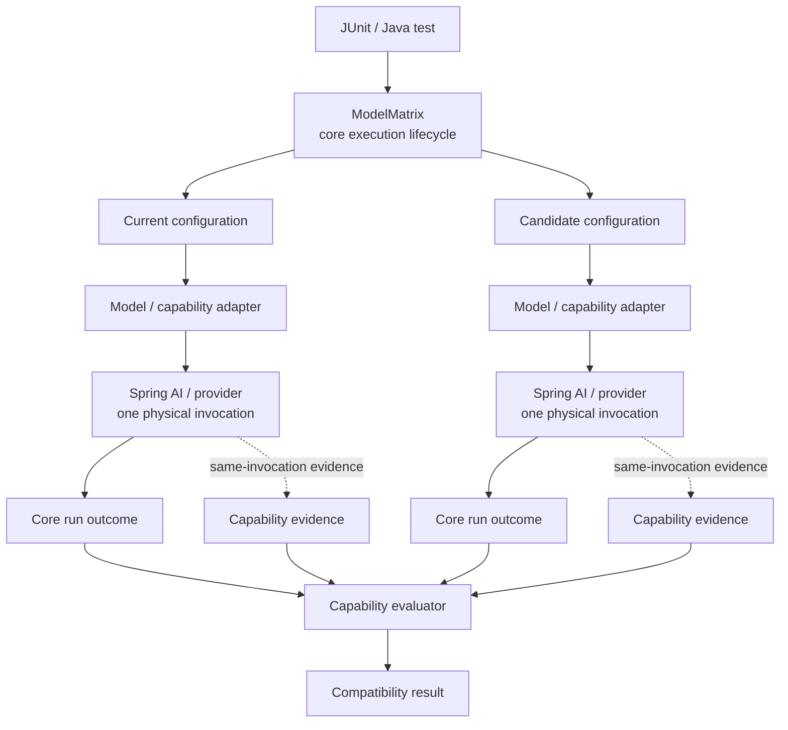

# ModelMatrix4J

**Regression-test AI model changes before they become application regressions.**

ModelMatrix4J is a Java testing library for Spring AI applications. It runs the same scenario against a current model configuration and one or more candidates, then compares the **application-visible behavior** your code depends on: text, structured output, tool calls, retrieved documents, and MCP tool interactions.

## Why this exists

Changing a model is a software change even when the Java code still compiles and the generated answer still looks reasonable.

A candidate model can regress the application in ways a text-only assertion misses.

**Tool calling**

```text
current:   weather({"city":"Berlin"})
candidate: searchWeb({"query":"Berlin weather"})
result:    MISMATCH
```

**Structured output**

```text
current:   {"city":"Berlin","temperature":18}
candidate: {"temperature":18.0,"city":"Berlin"}
result:    COMPATIBLE
```

The JSON is serialized differently, but the values are semantically equivalent.

**RAG / retrieval**

```text
current:   [berlin-transit-2026, station-accessibility]
candidate: [berlin-transit-2024, station-accessibility]
result:    MISMATCH
```

Both models may produce the same final sentence, but the candidate is now grounding it in an older logical document set.

**MCP**

```text
current:   maps.route({"from":"Berlin Hbf","to":"Brandenburg Gate","mode":"walking"})
candidate: maps.route({"from":"Berlin Hbf","to":"Brandenburg Gate","mode":"driving"})
result:    MISMATCH
```

Both configurations call the same MCP tool, but the candidate changes an argument the application relies on.

The question ModelMatrix4J answers is therefore not "which model is smarter?" It is:

> **If I replace the model behind this application, does the behavior my application relies on remain compatible?**

## Core model

The public execution model is deliberately small:

```text
Scenario
   +
ModelUnderTest[]
   |
   v
ModelMatrix.run(...)
   |
   v
CompatibilityResult
```

A `Scenario` is the input to execute. A `ModelUnderTest` gives one configuration a stable identity and an adapter. `ModelMatrix` owns the execution lifecycle. `CompatibilityResult` contains the ordered run outcomes and matrix-level status. A compatibility matrix requires at least two model configurations.

With Spring AI:

```java
ChatModel currentChatModel = ...;
ChatModel candidateChatModel = ...;

ModelUnderTest current = new ModelUnderTest(
        new ModelDescriptor("current"),
        new SpringAiModelAdapter(currentChatModel)
);

ModelUnderTest candidate = new ModelUnderTest(
        new ModelDescriptor("candidate"),
        new SpringAiModelAdapter(candidateChatModel)
);

Scenario scenario = new Scenario(
        "transit-summary",
        "Summarize public-transport options from Berlin Hbf."
);

CompatibilityResult result = ModelMatrix.builder()
        .models(current, candidate)
        .repetitions(1)
        .timeout(Duration.ofSeconds(30))
        .maxConcurrentInvocations(2)
        .build()
        .run(scenario);

assertEquals(CompatibilityStatus.COMPATIBLE, result.status());
```

`modelmatrix-core` is provider-neutral. Spring AI is an integration boundary, not a dependency of the core execution model.

`ModelMatrix` owns:

- repetitions;
- timeout and cancellation;
- bounded concurrency;
- deterministic result ordering;
- execution-status classification;
- plain-output normalization and compatibility.

The first successfully completed configuration is the reference for core text comparison. A reference is not assumed to be objectively correct; application-specific expected-value assertions still belong in your tests.

### Spring AI execution boundaries

`modelmatrix-spring-ai` binds each adapter at the lowest Spring AI abstraction that exposes the behavior under test.

- `SpringAiModelAdapter` and `SpringAiToolCallAdapter` operate on `ChatModel`. Their compatibility contracts concern one model invocation: generated text or the model's ordered tool-call requests. Advisor composition and client-level orchestration remain outside that boundary.
- `SpringAiRetrievalAdapter` and `SpringAiMcpToolAdapter` operate on `ChatClient` because their evidence is produced by client-level composition: advisor context for retrieval and callback execution during an MCP-capable client turn.
- The integration layer does not normalize these adapters onto one Spring AI type. Each adapter terminates at the layer that owns the observable contract, while `modelmatrix-core` remains independent of Spring AI.

## Behavioral contracts

Plain text equality is only the simplest contract. The capability modules compare the behavior that matters for a particular integration.

### Structured output

Structured output is validated before it is compared.

```text
{"city":"Berlin","temperature":18}
{"temperature":18.0,"city":"Berlin"}
                         -> COMPATIBLE

{"city":"Berlin","temperature":"18"}
                         -> INVALID for a NUMBER schema
```

The default semantics are explicit:

- object member order does not matter;
- array order does matter;
- numeric `1` and `1.0` are equivalent;
- missing and `null` are different;
- malformed JSON, duplicate keys, trailing tokens, and schema violations are invalid evidence rather than valid mismatches.

Example:

```java
var prepared = StructuredOutputExecution.prepare(List.of(current, candidate));

CompatibilityResult coreResult = ModelMatrix.builder()
        .models(prepared.models())
        .build()
        .run(new Scenario("weather-json", "Return city and temperature as JSON"));

JsonObjectSchema schema = new JsonObjectSchema(Map.of(
        "city", JsonObjectSchema.ValueType.STRING,
        "temperature", JsonObjectSchema.ValueType.NUMBER
));

StructuredOutputResult structured = new StructuredOutputEvaluator().evaluate(
        prepared.observations(coreResult),
        schema
);
```

### Tool calling

Tool compatibility compares ordered tool identity and semantic JSON arguments.

```text
weather({"city":"Berlin"})
weather({"city":"Berlin"})
                         -> COMPATIBLE

weather({"city":"Berlin"})
searchWeb({"query":"Berlin weather"})
                         -> MISMATCH
```

With Spring AI, `SpringAiToolCallAdapter` captures tool calls from the same model response used by the core run:

```java
var prepared = ToolExecution.prepare(List.of(
        new ToolModel(
                new ModelDescriptor("current"),
                new SpringAiToolCallAdapter(currentChatModel, weatherTool, searchTool)
        ),
        new ToolModel(
                new ModelDescriptor("candidate"),
                new SpringAiToolCallAdapter(candidateChatModel, weatherTool, searchTool)
        )
));

CompatibilityResult coreResult = ModelMatrix.builder()
        .models(prepared.models())
        .build()
        .run(new Scenario("weather", "What is the weather in Berlin?"));

List<ToolObservation> observations = prepared.observations(coreResult);
ToolCallComparison comparison = new ToolCallComparator().compare(
        observations.get(0).calls(),
        observations.get(1).calls()
);
```

Malformed tool arguments are `INVALID_ARGUMENTS`; they are not collapsed into `MISMATCH`.

### RAG / retrieval

RAG tests should not assert only the final generated sentence. Grounding is part of application behavior.

ModelMatrix4J compares **ordered stable logical document identities** rather than vector-store implementation details such as embeddings, similarity scores, or provider-specific IDs.

```text
current:   [berlin-transit-2026, station-accessibility]
candidate: [berlin-transit-2024, station-accessibility]
                         -> MISMATCH
```

`SpringAiRetrievalAdapter` observes documents already produced by a Spring AI `ChatClient` advisor chain. It does not execute retrieval again.

```java
Function<Document, String> documentIdentity = document ->
        Objects.toString(document.getMetadata().get("document_id"));

var prepared = RetrievalExecution.prepare(List.of(
        new RetrievalModel(
                new ModelDescriptor("current"),
                new SpringAiRetrievalAdapter(
                        currentClient,
                        "retrieved_documents",
                        documentIdentity
                )
        ),
        new RetrievalModel(
                new ModelDescriptor("candidate"),
                new SpringAiRetrievalAdapter(
                        candidateClient,
                        "retrieved_documents",
                        documentIdentity
                )
        )
));

CompatibilityResult coreResult = ModelMatrix.builder()
        .models(prepared.models())
        .build()
        .run(new Scenario(
                "transit-docs",
                "Which transit options are available from Berlin Hbf?"
        ));

RetrievalResult retrieval = new RetrievalEvaluator().evaluate(
        prepared.observations(coreResult)
);
```

The advisor-context key and stable document identity are application decisions. ModelMatrix4J does not pretend a vector-store row ID is automatically the domain identity of a document.

### MCP

MCP compatibility focuses on application-visible tool interactions. It compares tool identity, semantic arguments, missing/additional calls, and call order.

For example, suppose the application asks for a walking route:

```text
current:
  maps.route({
    "from":"Berlin Hbf",
    "to":"Brandenburg Gate",
    "mode":"walking"
  })

candidate:
  maps.route({
    "from":"Berlin Hbf",
    "to":"Brandenburg Gate",
    "mode":"driving"
  })

result: MISMATCH
```

The tool name is unchanged, but `mode` changed from `walking` to `driving`. That is valid MCP evidence with different application-visible behavior, so it is a mismatch rather than an execution failure.

`SpringAiMcpToolAdapter` observes supplied MCP-backed tool callbacks during the same Spring AI `ChatClient` turn. MCP transport and session ownership remain outside ModelMatrix4J.

```java
var prepared = McpExecution.prepare(List.of(
        new McpModel(
                new ModelDescriptor("current"),
                new SpringAiMcpToolAdapter(currentClient, currentMcpTools)
        ),
        new McpModel(
                new ModelDescriptor("candidate"),
                new SpringAiMcpToolAdapter(candidateClient, candidateMcpTools)
        )
));

CompatibilityResult coreResult = ModelMatrix.builder()
        .models(prepared.models())
        .build()
        .run(new Scenario(
                "walking-route",
                "Give me a walking route from Berlin Hbf to Brandenburg Gate"
        ));

McpResult mcp = prepared.evaluate(coreResult);
```

## Architecture: execution and evidence are separate concerns

This is the central design decision in ModelMatrix4J.



**Core owns physical execution. Capability modules capture evidence from those same executions. Evaluation never invokes the model a second time.**

That rule is intentional:

- **Causality:** evaluated tool calls, retrieved documents, and MCP interactions belong to the exact run whose status and timeout are reported.
- **No LLM judge dependency:** compatibility does not require another nondeterministic model call to judge the first call.
- **No duplicate inference cost:** inspection does not double model invocations.
- **Stable dependency direction:** core does not import Spring AI, retrieval, tool-calling, or MCP types.
- **Evidence ownership:** capability evidence is correlated by stable configuration/repetition identity, consumed once, and closed against late publication.
- **Honest failure semantics:** infrastructure failure, malformed evidence, and valid behavioral disagreement remain different states.

The capability modules share this execution/evidence pattern without introducing a generic evidence framework into the public core API.

## Result semantics

A regression test is only useful if it does not confuse disagreement with inability to execute.

```text
COMPATIBLE
  successful executions agree under the selected contract

MISMATCH
  successful executions produced valid but different behavior

INVALID / INVALID_ARGUMENTS
  capability evidence violates its contract

UNAVAILABLE
  a configured model or provider is unavailable

EXECUTION_FAILURE
  timeout, cancellation, provider exception, or another execution failure
```

## JUnit

`modelmatrix-junit` plugs the same execution model into JUnit Jupiter:

```java
class ModelUpgradeTest implements ModelMatrixSource {

    @Override
    public Scenario scenario() {
        return new Scenario(
                "transit-summary",
                "Summarize public-transport options from Berlin Hbf."
        );
    }

    @Override
    public List<ModelUnderTest> models() {
        return List.of(current, candidate);
    }

    @Override
    public int repetitions() {
        return 3;
    }

    @Override
    public Duration timeout() {
        return Duration.ofSeconds(30);
    }

    @Override
    public int maxConcurrentInvocations() {
        return 2;
    }

    @ModelMatrixTest
    void candidatePreservesBehavior(CompatibilityResult result) {
        assertEquals(CompatibilityStatus.COMPATIBLE, result.status());
    }
}
```

The JUnit source configures the same repetitions, timeout, and concurrency rules used by direct `ModelMatrix` execution.

## Reporting and persistence

`modelmatrix-report` projects a completed result into a deterministic, versioned report. Reporting does not invoke a model again.

```java
CompatibilityReport report = new ReportProjector().project(result);
String json = new JsonReportWriter().write(report);
```

A persisted report has a deliberately small schema:

```json
{
  "schemaVersion": "1",
  "status": "MISMATCH",
  "runs": [
    {
      "runId": "run-current",
      "scenarioId": "transit-summary",
      "configurationId": "current",
      "repetition": 0,
      "status": "COMPLETED",
      "durationNanos": 184250000
    },
    {
      "runId": "run-candidate",
      "scenarioId": "transit-summary",
      "configurationId": "candidate",
      "repetition": 0,
      "status": "COMPLETED",
      "durationNanos": 201830000
    }
  ]
}
```

The report records stable execution identity and status, but intentionally does **not** persist model output, diagnostics, structured payloads, tool arguments/results, retrieved content, or MCP arguments. Those values may be acceptable in process but are not automatically safe to write into CI artifacts.

The durable report is therefore a separate persistence boundary, not a raw serialization of in-process objects.

## Modules

```text
modelmatrix-core        provider-neutral execution kernel
modelmatrix-junit       JUnit Jupiter integration
modelmatrix-structured  structured-output validation and comparison
modelmatrix-tool        tool-call evidence and comparison
modelmatrix-rag         retrieval evidence and comparison
modelmatrix-mcp         MCP tool-interaction evidence and comparison
modelmatrix-report      deterministic report projection
modelmatrix-spring-ai   Spring AI adapters
```

The dependency direction is intentional. Framework-specific types stay at integration boundaries; capability semantics stay outside the core execution kernel.

## Verification

Verification is split by what it proves.

**Default project verification**

```bash
./mvnw -B clean verify
```

This runs the normal module test suites. The opt-in `ollama-it`, `pgvector-it`, and `mcp-it` profiles are not activated, so this path does not start or connect to Ollama, pgvector, or an MCP server. Maven may still resolve and compile test-scope integration dependencies as part of the build; the corresponding integration tests are not executed.

**Standalone Maven consumer verification**

```bash
./scripts/verify-external-consumer.sh
```

This stages the current artifacts in an isolated temporary Maven repository, then builds and tests the standalone consumer fixtures outside the reactor. Consumer dependencies are prepared first and the actual consumer test runs execute in Maven offline mode. The consumer fixtures use in-memory adapters and deterministic evidence; they do not start or connect to Ollama, pgvector, or an MCP server.

The staging reactor build uses `-DskipTests`, so tests are not executed while the artifacts are installed. Maven can still resolve and compile test-scope dependencies during that staging build.

**Reproducibility check**

```bash
bash scripts/verify-reproducible-builds.sh
```

The reproducibility check builds the project twice in isolated Maven repositories and compares the resulting JAR and POM paths and SHA-256 hashes. It does not activate the opt-in Ollama, pgvector, or MCP integration-test profiles.

**Opt-in integration slices**

Ollama exercises a real Spring AI -> Ollama model path. To run it, Ollama must be reachable at `http://localhost:11434` by default, with `mistral` and `llama2` available unless the test properties are overridden.

```bash
./mvnw -B verify -Pollama-it
```

The pgvector profile exercises the Spring AI retrieval advisor against a real pgvector store. It requires Docker or another Testcontainers-compatible runtime; the test starts its own `pgvector/pgvector:pg16` container and uses deterministic local model fixtures.

```bash
./mvnw -B verify -Ppgvector-it
```

The MCP profile exercises a real MCP SDK client/server round-trip and Spring AI MCP callbacks, but the server is created in-process by the test. No separately running MCP server is required.

```bash
./mvnw -B verify -Pmcp-it
```

## Scope

ModelMatrix4J is not an LLM benchmark, an LLM-as-a-judge platform, an inference gateway, or a hosted evaluation service. It also does not replace application-specific assertions about what the correct answer should be.

It is a regression-testing library for comparing application-visible behavior across AI model configurations.

## Documentation

- [`docs/PRODUCT_SPEC.md`](docs/PRODUCT_SPEC.md) — product rationale, users, scope, and non-goals
- [`docs/ARCHITECTURE.md`](docs/ARCHITECTURE.md) — dependency boundaries and execution/evidence ownership
- [`docs/PUBLIC_API.md`](docs/PUBLIC_API.md) — supported Java API surface
- [`docs/REPORT_SCHEMA.md`](docs/REPORT_SCHEMA.md) — durable report schema and compatibility policy
