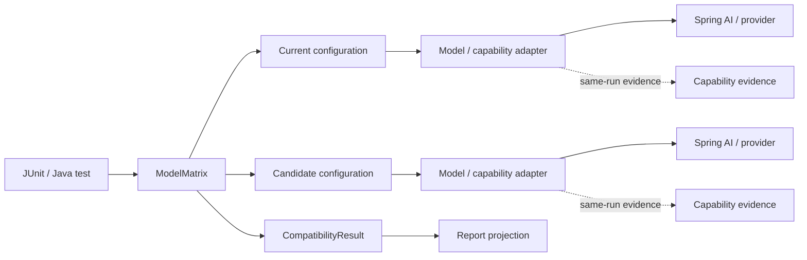

# ModelMatrix4J architecture

## 1. Architectural summary

ModelMatrix4J is a layered Java test library for comparing application-visible behavior across AI model configurations.

The architecture separates four concerns:

- `modelmatrix-core` owns execution lifecycle and provider-neutral run results;
- capability modules own structured, tool, retrieval, and MCP evidence semantics;
- `modelmatrix-spring-ai` translates Spring AI behavior into those provider-neutral contracts;
- `modelmatrix-report` projects completed core results into a persistence-safe report format.

The central execution rule is:

> **Core owns execution. Capability evidence comes from the same execution. Evaluation does not invoke the model again.**

This keeps timeout, cancellation, ordering, status classification, and evidence causally tied to the run that produced them.

## 2. System context



ModelMatrix4J does not own the application under test, provider credentials, provider retry policy, a database, an MCP transport/session, or a hosted control plane.

## 3. Module boundaries

| Module | Responsibility | Main dependency boundary |
| --- | --- | --- |
| `modelmatrix-core` | Scenario execution, timeout/cancellation, repetitions, concurrency, ordering, core compatibility | JDK only |
| `modelmatrix-junit` | JUnit Jupiter lifecycle and result injection | core + JUnit |
| `modelmatrix-structured` | Semantic JSON comparison and structured validation | core + Jackson |
| `modelmatrix-tool` | Ordered tool-call evidence and comparison | core + structured |
| `modelmatrix-rag` | Retrieval evidence and logical-document comparison | core |
| `modelmatrix-mcp` | Ordered MCP tool-interaction evidence and comparison | core + structured |
| `modelmatrix-spring-ai` | Spring AI adapters at the appropriate framework boundary | core/capabilities + Spring AI |
| `modelmatrix-report` | Deterministic report projection and rendering | core + Jackson |

Dependencies point toward smaller provider-neutral contracts. Spring AI, MCP SDK, pgvector, Testcontainers, and provider-specific types do not cross into `modelmatrix-core`.

The project deliberately does not introduce a public generic `Evidence<T>`, event bus, capability kernel, provider registry, or separate execution engine. Current capabilities have concrete contracts and share execution ownership without forcing them into a speculative abstraction.

## 4. Core execution contract

A compatibility matrix requires at least two model configurations.

`ModelMatrix` expands one scenario over declared model configurations and repetitions in deterministic model-major/repetition-minor result order. Physical completion order does not change returned ordering.

Core owns:

- repetition scheduling;
- timeout and cancellation;
- bounded physical concurrency;
- terminal run-status classification;
- deterministic result ordering;
- normalized plain-text comparison;
- sanitized and bounded public results.

Different model configurations may execute concurrently. Repetitions for one declared configuration execute sequentially because core does not assume an adapter is safe for concurrent re-entry.

A failed or unavailable repetition does not suppress later repetitions. A timed-out repetition suppresses later repetitions for that same configuration so a non-cooperative invocation cannot be re-entered concurrently.

Timeout is a total execution budget and includes concurrency-admission wait. When a timed-out adapter ignores interruption and continues physically, its concurrency permit remains held until the underlying invocation actually exits. Releasing the permit at logical timeout would allow physical concurrency to exceed `maxConcurrentInvocations`.

ModelMatrix4J performs no hidden retries.

## 5. Core compatibility semantics

Core compatibility is evaluated from normalized successful outputs before public redaction or diagnostic bounding.

Status precedence is:

```text
EXECUTION_FAILURE
    >
UNAVAILABLE
    >
MISMATCH
    >
COMPATIBLE
```

Rules:

- any failed, timed-out, or cancelled run produces `EXECUTION_FAILURE`;
- otherwise any explicitly unavailable run produces `UNAVAILABLE`;
- otherwise differing normalized successful outputs produce `MISMATCH`;
- otherwise the matrix is `COMPATIBLE`.

For plain-text core comparison, the first successfully completed normalized output in deterministic result order becomes the reference and every other successful normalized output is compared with it. The reference is not assumed to be objectively correct.

This means repetitions currently participate in the same core text-compatibility comparison; core does **not** implement paired per-repetition comparison semantics. Application-specific correctness and repeatability assertions remain separate test concerns.

Public sanitization cannot change the compatibility decision. Comparison happens before lossy result mapping, while diagnostics exposed through `RunResult` are bounded and sanitized.

## 6. Capability execution and evidence ownership

Structured output, tool calling, retrieval, and MCP use the same composition rule:

```text
capability model/adapter
        |
        v
prepared wrapper -----> ModelMatrix.run(...)
        |                     |
        |                     v
        |              CompatibilityResult
        |
        +---- private same-run evidence
                              |
                              v
                     capability evaluator
```

Capability evidence remains outside `RunResult`. It is correlated with configuration/repetition identity, accepted only for the active prepared execution, consumed once, and closed against late publication.

Timed-out, cancelled, failed, or physically late work must not attach evidence to a completed result. Capability evaluators consume already-produced evidence and never perform a second model invocation merely to inspect behavior.

## 7. Structured-output contract

Structured output is compared as JSON data rather than serialized text.

Current semantics are:

- object member order is ignored;
- array order is significant;
- insignificant JSON whitespace is ignored;
- numeric values compare by value, so `1` and `1.0` are equivalent;
- missing and explicit `null` are different;
- duplicate keys and malformed JSON are invalid evidence;
- declared object fields are required and validated against the supported value types;
- extra object fields are allowed.

Capability validation and cross-configuration disagreement are separate states:

- equivalent valid values -> `COMPATIBLE`;
- different valid values -> `MISMATCH`;
- malformed or schema-invalid evidence -> `INVALID`.

Structured validation diagnostics must not echo protected payload values.

## 8. Tool-calling contract

Tool compatibility compares the ordered sequence of tool identities and semantic JSON arguments.

Observable differences include:

- missing or additional calls;
- different tool identity;
- different valid arguments;
- different call order.

Malformed argument JSON is `INVALID_ARGUMENTS`, not `MISMATCH`.

Tool results are observable through capability evidence but are not part of the compatibility comparison contract. For valid arguments, `SpringAiToolCallAdapter` invokes the matching supplied callback at most once for the observed call. Unknown tools remain observable without executing a different callback.

Tool/runtime exceptions remain execution failures. Timeout ownership belongs to the core `ModelMatrix` lifecycle rather than to a separate timeout inside the Spring AI tool adapter.

## 9. Retrieval contract

Retrieval compatibility compares ordered stable logical document identities.

The default contract excludes:

- embeddings;
- similarity scores;
- provider/vector-store row IDs;
- raw retrieved document text;
- vector-store implementation details.

`SpringAiRetrievalAdapter` operates at the `ChatClient` boundary because retrieval evidence is produced by advisor/client composition. It observes documents from the same client execution and does not run retrieval again for evaluation.

The mapping from a Spring AI `Document` to application-level logical identity is supplied by the application/test.

## 10. MCP contract

MCP compatibility compares application-visible ordered tool interactions:

- tool identity;
- semantic JSON arguments;
- missing/additional calls;
- interaction order.

Malformed arguments are invalid capability evidence rather than behavioral mismatch.

MCP transport, discovery, client/server lifecycle, sessions, protocol frames, SDK objects, and resource compatibility are outside the provider-neutral contract.

`SpringAiMcpToolAdapter` operates at the `ChatClient` boundary because callback execution is part of the composed client turn. Evidence is observed from that same turn rather than reconstructed by another execution.

## 11. Spring AI boundaries

`modelmatrix-spring-ai` binds each adapter at the lowest Spring AI abstraction that owns the observable behavior under test.

- `SpringAiModelAdapter` -> `ChatModel`: generated text from one model invocation.
- `SpringAiToolCallAdapter` -> `ChatModel`: ordered tool-call requests and callback execution for that response.
- `SpringAiRetrievalAdapter` -> `ChatClient`: advisor/client retrieval context.
- `SpringAiMcpToolAdapter` -> `ChatClient`: MCP-backed callback interactions during a composed client turn.

The integration layer does not normalize all adapters onto one Spring AI type for cosmetic consistency. Spring application context and Spring Boot autoconfiguration are not library responsibilities.

## 12. Result and persistence-security boundary

`RunResult` is an in-process execution result, not a persistence authorization boundary.

Provider-native payloads, credentials, authorization headers, raw capability payloads, retrieved private content, tool arguments/results, and MCP arguments must not leak through incidental diagnostics or rendering.

`modelmatrix-report` therefore projects a deliberately narrower durable representation. Schema `1` contains only:

- schema version;
- matrix compatibility status;
- run/scenario/configuration/repetition identity;
- run status;
- duration.

Model output, diagnostics, structured payloads, tool arguments/results, retrieved content, MCP arguments, and provider payloads are absent from the default durable schema.

Any future widening of the persisted surface requires an explicit schema and security decision. The current durable format is defined in [`REPORT_SCHEMA.md`](REPORT_SCHEMA.md).

## 13. JUnit integration

`modelmatrix-junit` exposes the same core execution model through `@ModelMatrixTest` and `ModelMatrixSource`.

`ModelMatrixSource` supplies:

- scenario;
- at least two model configurations;
- repetitions;
- timeout;
- maximum concurrent invocations.

The JUnit extension owns lifecycle and parameter resolution only. It does not duplicate execution or compatibility logic.

## 14. Public API boundary

Supported consumer-facing Java types are documented in [`PUBLIC_API.md`](PUBLIC_API.md). Package membership or Java `public` visibility alone does not make a type part of the reviewed consumer surface.

Internal orchestration, evidence stores, callback decorators, correlation keys, integration fixtures, and framework wiring remain implementation details unless deliberately added to that baseline.

## 15. Build and verification

The repository uses the Maven Wrapper, a coordinated `${revision}` version, flattened consumer-facing POMs, centralized dependency management, Java 25 compiler settings, dependency convergence enforcement, and deterministic tests.

Default verification:

```bash
./mvnw -B clean verify
```

CI also verifies:

- standalone consumers outside the root reactor;
- reproducible JAR/POM build artifacts.

Real Ollama, pgvector, and MCP integration slices remain opt-in:

```bash
./mvnw -B verify -Pollama-it
./mvnw -B verify -Ppgvector-it
./mvnw -B verify -Pmcp-it
```

The default build does not require a running model provider, vector database, MCP server, cloud account, or provider credential.
