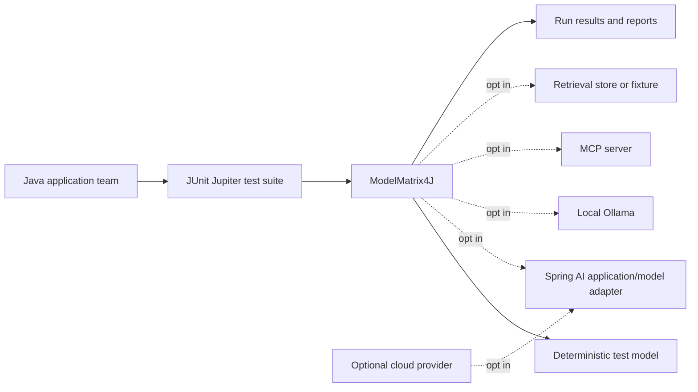
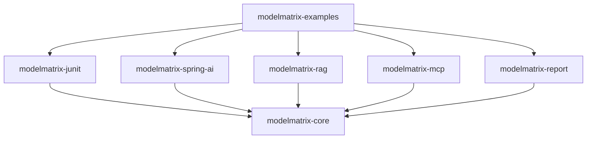
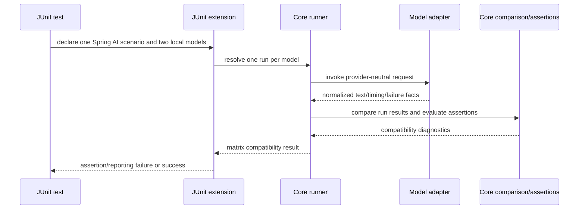

# ModelMatrix4J architecture

## 1. Architectural summary

ModelMatrix4J is a layered test library. The core owns the execution vocabulary and deterministic orchestration. Adapters own translation to Spring AI, MCP, retrieval stores, local processes, and cloud clients. JUnit owns developer-facing test lifecycle. Reporting consumes completed core results and is not part of execution.

The first implementation should publish only the smallest useful modules. Planned modules are added when their milestone has a concrete contract; the repository must not create empty extension modules merely to reserve names. The M3 vertical slice is the first end-to-end product proof: one Spring AI scenario, two local Ollama model configurations, and a compatibility result.

The delivery sequence is intentionally compressed: M1 establishes Java/Maven; M2 proves core plus JUnit with deterministic models; M3 proves Spring AI plus Ollama; M4 adds structured output and Java tool calling; M5 adds RAG/pgvector; M6 adds MCP; M7 adds provider matrix/reporting; M8 hardens the OSS release.

## 2. System context

The framework does not own the application under test, the model provider, a database, or a hosted control plane.

## 3. Module boundaries

### Publishable modules

| Module | Responsibility | Allowed dependencies | Default-build status |
| --- | --- | --- | --- |
| `modelmatrix-core` | Domain model, scenario execution ports, orchestration, normalized results, core assertion contract | JDK-only unless a specific small dependency is justified | Required |
| `modelmatrix-junit` | JUnit Jupiter extension, test configuration, model/scenario injection, failure mapping | `modelmatrix-core`, JUnit Jupiter | Required for JUnit users; optional to core |
| `modelmatrix-spring-ai` | Translate the smallest necessary Spring AI client surface into core ports; includes the opt-in Ollama vertical-slice path | `modelmatrix-core`, the smallest necessary Spring AI API dependencies | Optional, M3 |
| `modelmatrix-rag` | Provider-neutral retrieval fixtures and retrieval assertions | `modelmatrix-core` | Optional, M5 |
| `modelmatrix-mcp` | Provider-neutral MCP interaction model and assertions | `modelmatrix-core` | Optional, M6 |
| `modelmatrix-report` | Serialize and summarize completed runs/matrices for CI and local analysis | `modelmatrix-core`, Jackson only if format support requires it | Optional, M7 |
| `modelmatrix-examples` | Small executable examples and opt-in integration-test demonstrations | Optional modules; never a dependency of library modules | Non-library/demo |

`modelmatrix-rag` and `modelmatrix-mcp` are capability contracts, not database or server implementations. If an adapter needs Spring AI or a specific store, it belongs in a separately named adapter module created when that integration is implemented (for example, a future `modelmatrix-rag-spring-ai`), not in core. Spring Boot may be used by examples or integration tests; it is not a convenience dependency of `modelmatrix-spring-ai` unless a concrete library requirement proves it necessary.

### Internal test-only area

An eventual `modelmatrix-integration-tests` module or equivalent Maven profile may contain Ollama, Testcontainers, RAG, MCP, and cloud tests. It is not published as a runtime library. This boundary is justified by credential, process, timing, and parallelism concerns; it must not leak those dependencies into the default reactor path.

### Deliberately rejected modules

- A separate `modelmatrix-engine` is unnecessary initially: pure orchestration belongs with the core contract until independent release/versioning pressure exists.
- Provider-named runtime modules are not required for the core architecture. A provider adapter may be added later when it has a supported API and opt-in test suite.
- A shared `modelmatrix-test-support` module is deferred until two test layers demonstrably share stable fixtures.

### Java package and source layout

The Java package root is `com.modelmatrix4j`. Concrete packages are designed only when an approved milestone introduces their first real production types and tests. The task delegation then records the necessary package and dependency boundaries; documentation does not reserve future package names.

Keep types and members at the narrowest useful visibility. Public API requires a concrete current-milestone consumer, a consumer test, and independent review. Public signatures must not expose internal implementation, framework/provider, or later-capability types.

Tests remain in the module whose contract they exercise. Deterministic fakes remain test-scoped and local to the consuming module. Do not create empty directories, `package-info` placeholders, speculative layers, or shared test-support packages in anticipation of future work. JUnit depends only on supported core public contracts; core never depends on JUnit.

## 4. Dependency direction

Dependencies point inward toward core. Core must not discover or reflectively load optional adapters as part of normal execution. Service loading may be considered for an explicit adapter registry later, but it must not make provider availability implicit.

## 5. Core responsibilities and prohibited dependencies

Core owns:

- immutable identifiers and descriptors;
- a scenario execution contract;
- model invocation ports;
- one-run and matrix orchestration;
- basic normalized textual output, failure, timing, and bounded safe diagnostics;
- assertion evaluation and aggregation;
- cancellation, timeout, repetition, and concurrency policy at the provider-neutral level.

Core does not own:

- Spring application context or bean discovery;
- Spring AI prompt/client types;
- MCP protocol/client/server types;
- PostgreSQL, pgvector, Testcontainers, or Docker lifecycle;
- OpenAI, Anthropic, Google, Ollama, or other provider SDK types;
- cloud credentials or network retries specific to a provider;
- report rendering, dashboards, or persistence.

The hard architectural rule is: `modelmatrix-core` must have no dependency whose group or package requires Spring, Spring Boot, Spring AI, MCP, PostgreSQL, or a provider SDK. An architecture test and dependency inspection should enforce this once code exists.

## 6. Extension points

M2 requires only one executable boundary: an adapter-backed model under test that accepts a scenario and produces a minimal run result. M2 also requires a minimal compatibility comparison over multiple run results, but that evaluator can remain a concrete function or class until a second consumer proves that an interface is useful.

The following are architectural roles, not a commitment to one public interface per noun:

1. **Model execution** translates a provider-neutral scenario into a run result.
2. **Assertion evaluation** evaluates a run or matrix result without invoking the model.
3. **Adapter normalization** translates Spring AI/provider responses into the small M2/M3 result vocabulary. Capability-specific projections are deferred until their milestone.
4. **Result consumption** formats or reports completed results.

Implement only the roles needed by the current milestone. Provider selection is data/configuration supplied to execution; core contains no provider-name conditional branches.

## 7. Provider abstraction

A provider adapter supplies:

- a stable model descriptor (provider identity, model identity, capabilities, and non-secret metadata);
- an invocation implementation;
- translation of provider-specific failures and events into normalized facts;
- optional adapter diagnostics that remain outside the core contract when they cannot be normalized.

The descriptor is not a provider SDK client and must not contain secrets. Capability declarations are claims used for selection and reporting; observed run facts remain authoritative for assertions. A missing adapter, credential, or local service is an explicit unavailable/skip outcome in opt-in tests and never a reason for the default deterministic build to fail.

## 8. Scenario execution model

One scenario run has one scenario, one model under test, and one run identity. A matrix expands a scenario into independent work items. The runner preserves the association between each result and its scenario/model/repetition/configuration without requiring those resolution details to be public types.

The core execution path must make timeout, cancellation, repetition, and concurrency explicit. It must not silently retry a model call because retries change behavioral measurements. Provider-specific retry behavior belongs in the adapter and must be reported as part of diagnostics.

## 9. Result model

The core `RunResult` is the one immutable record of an execution, not a live response object. There is no separate public lifecycle aggregate. In M2/M3 it contains only:

- run identity, scenario identity, model descriptor, repetition index, and resolved configuration identity;
- lifecycle status: passed, failed, unavailable, cancelled, timed out, or otherwise explicitly classified;
- basic normalized textual output where available;
- start/end or duration data using a monotonic measurement for latency;
- normalized failure category, safe message, and diagnostic metadata;
- bounded safe diagnostics.

Secrets, authorization headers, prompts marked sensitive, and unbounded provider payloads must not be copied into results by default. Raw provider responses are adapter diagnostics and require explicit opt-in. Structured-output and Java tool-call projections begin in M4; retrieval projections begin in M5; MCP projections begin in M6. No generic event or interaction abstraction is introduced in M2 merely to anticipate those capabilities.

## 10. Assertion architecture

Assertions operate on run or compatibility results, not provider clients. Core assertions cover identity, status, output presence, failure classification, timing policy, repetition aggregation, and the minimal M2 comparison. Capability modules provide structured-output, tool-call, retrieval, and MCP assertions at the layer that introduces those facts.

An assertion returns a structured diagnostic with a stable name, outcome, human-readable reason, and machine-readable details. AssertJ integration belongs in `modelmatrix-junit` or a later assertion artifact; core must not require AssertJ merely to evaluate a result. Assertions should distinguish:

- a behavioral mismatch;
- an execution failure;
- an unavailable optional dependency;
- an invalid test/scenario configuration.

## 11. JUnit integration strategy

`modelmatrix-junit` owns annotations, extension lifecycle, parameter resolution, display names, and conversion of run/assertion diagnostics into Jupiter failures. It must not move model execution into static global state. Test-instance, method, and invocation scopes must be explicit. M2 proves this against deterministic fake models; M3 proves the same path with Spring AI and two local Ollama configurations.

The initial integration should support a programmatic path alongside the annotation path so the execution contract can be tested independently of extension mechanics. The eventual `@ModelMatrixTest` API is a compatibility goal, not a reason to expose every internal engine type.

## 12. Spring AI + Ollama vertical slice strategy

`modelmatrix-spring-ai` translates the smallest necessary Spring AI request/response surface at the boundary. It must not depend on Spring Boot merely for convenience. Spring context setup, bean selection, and Spring Boot test lifecycle remain in examples or integration tests unless a concrete publishable-library requirement proves otherwise. Application-facing adapters must not make core scenarios contain Spring types.

In M3, the adapter exposes two explicitly configured local Ollama model targets through the same Spring AI scenario. The integration test compares their normalized `RunResult` values and returns a compatibility result. Ollama is never a required dependency or hidden default; service/model availability is checked before invocation and classified explicitly.

## 13. RAG strategy

RAG testing has two separate concerns:

1. deterministic retrieval fixtures and assertions (provider-neutral, suitable for `modelmatrix-rag`);
2. integration with an embedding model/vector store (a future adapter/test module, optionally PostgreSQL + pgvector).

The first concern can test ranking, filtering, citation/use-of-context, and no-result behavior with fixed data. The second must be opt-in and isolated. RAG must not become a dependency of the core execution kernel.

## 14. MCP strategy

`modelmatrix-mcp` will normalize MCP tool/resource interactions and provide capability assertions. MCP client/server lifecycle and Spring AI MCP integration belong in adapter/test modules. MCP protocol types must not cross into core. Server availability and protocol failures must be classified separately from a behavioral assertion mismatch.

## 15. Reporting architecture

The minimal compatibility result belongs to core from M2 because M2 already compares multiple deterministic runs. Reporting is a later consumer of those results. M7 adds stable reporting, serialization, CI artifacts, richer presentation, and richer comparison rules; it does not introduce compatibility comparison. Human-readable JUnit failure text belongs to the JUnit module. No report requires a database or network service. Report schemas must version their format independently from provider metadata.

## 16. Concurrency and failure isolation

Runs are independent work items by default. Shared mutable adapter state, global model clients, random seeds, temporary files, and port allocation must be explicit. Parallel execution is opt-in until adapters prove thread safety. A failed or timed-out run must not prevent remaining matrix work from completing unless the caller chooses fail-fast. Results must retain partial diagnostics when safe.

External failures are isolated by test layer and profile. A deterministic test never contacts a provider. An Ollama test never runs unless its profile and availability check are enabled. Cloud tests require explicit credentials and a separate CI job.

## 17. Configuration strategy

Configuration is resolved in a documented precedence order: explicit test/matrix values, suite configuration, supported system/environment values, then safe defaults. Secrets come only from environment/secret providers and are never serialized into descriptors or reports by default. Configuration must be immutable after a run starts. Provider-specific settings are opaque to core and validated by their adapter.

## 18. Build and quality guardrails

The Maven build should use the Maven Wrapper, centralized dependency management, Java 25 compiler settings, warning visibility, and a formatter/static-analysis stack only when each tool has a concrete failure mode to prevent. The first justified guardrails are:

- dependency convergence and reproducible dependency versions;
- an architecture/dependency test proving core remains framework-free;
- formatting in CI to prevent noisy diffs;
- unit and contract tests on every build;
- opt-in integration profiles for external systems.

Checkstyle, Spotless, Error Prone, NullAway, JaCoCo, and ArchUnit are not automatic requirements. Each is adopted only with a recorded problem, agreed scope, and acceptable maintenance cost.
