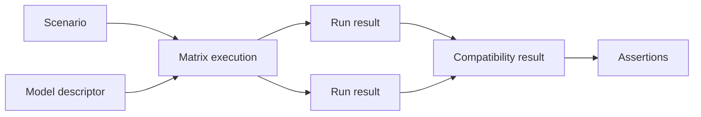

# ModelMatrix4J domain model

## 1. Design objective

The domain model exists to support the first product proof: execute one Spring AI scenario against two local model configurations and compare the observable outcomes. It must not become a general framework of interfaces before an implementation use case requires one.

The vocabulary below is intentionally small. A concept is not automatically a public Java type; some concepts may remain implementation details until a milestone proves that callers need them.

## 2. Minimum useful vocabulary

### Scenario

A scenario is a named, reusable description of one behavioral interaction: its input, any test-scoped setup, and the observations that the adapter must make available. It is provider-neutral and contains no Spring AI client, provider branch, credential, or mutable run state.

A scenario does not decide whether behavior passes. It describes what to execute and what can be observed. This keeps the same scenario reusable across models and keeps evaluation policy in assertions.

### Model descriptor

A model descriptor identifies one executable model configuration with non-secret metadata such as provider/model identity, local endpoint label, capabilities, and configuration identity. It is used for selection and result correlation. It is not a client, credential holder, or provider service.

Provider identity is data on the descriptor, not a `ModelProvider` service abstraction. Core must not branch on provider names.

### Model under test

A model under test is the adapter-backed executable target used by the runner. It combines a model descriptor with the ability to execute a scenario. This boundary is needed by the M3 Spring AI + Ollama slice; the underlying client remains owned by the adapter.

### Run result

`RunResult` is the one public concept for a completed scenario/model execution. In M2/M3 it contains only the execution facts needed by the vertical slice: run/scenario/model identity, terminal status, basic normalized textual output where applicable, timing, and bounded safe diagnostics. It does not contain structured-output, Java tool-call, retrieval, or MCP-specific public types.

There is deliberately no separate public `ModelRun` lifecycle object. A live execution handle, cancellation token, or internal state machine may exist inside the runner if implementation needs it, but callers receive one immutable `RunResult`. Splitting `ModelRun` and `ModelRunResult` before a caller needs both would create lifecycle coupling and an unnecessary API.

### Compatibility result

`CompatibilityResult` is the minimal core aggregate introduced in M2 alongside deterministic matrix execution. It groups the `RunResult` values produced by applying one scenario to multiple model descriptors and optional repetitions. It preserves each result and adds only the minimal comparison facts needed to distinguish matching, differing, failed, and unavailable outcomes. M7 enriches presentation and comparison rules; it does not introduce this aggregate.

### Assertion

An assertion evaluates a `RunResult` or `CompatibilityResult`. It owns pass/fail policy, tolerances, normalization rules specific to a capability, and diagnostic wording. Assertions do not invoke models or mutate scenarios.

Core assertions should be limited to status, presence, identity, timing, and aggregate comparison. Structured-output, tool-calling, RAG, and MCP assertions belong in the capability module that introduces the corresponding normalized observation.

## 3. Relationships

One scenario is expanded over an ordered set of model descriptors. Each expansion produces an independent result. Core comparison creates the compatibility result before assertions evaluate it; assertions are not hidden inside the scenario definition.

## 4. Concepts intentionally deferred

- `ModelProvider`: provider identity is descriptor data; a provider-specific service object would invite conditionals and client leakage.
- `Capability`: a capability may remain metadata on a descriptor until a concrete feature needs a typed contract. Do not create a capability registry in M2.
- `ToolInvocation`, `RetrievalResult`, and MCP session types: these become typed observations only in M4, M5, or M6 when their assertions and adapters exist.
- Structured-output and tool-call projections: do not add them to `RunResult`; introduce them in M4. Retrieval projections begin in M5, and MCP projections begin in M6.
- Generic event bus, plugin registry, repository, persistence aggregate, and report sink: none is required for the M2/M3 execution path.
- Separate `ExecutionContext`, `RunSpecification`, and `ModelRun`: resolve configuration internally first; promote a value to public API only when a consumer or adapter needs it.

## 5. Lifecycle and invariants

1. A scenario and model descriptor are identifiable before invocation.
2. Each matrix item has one scenario, one model descriptor, and an explicit repetition index.
3. Every completed execution has exactly one terminal status.
4. Every result retains scenario/model correlation and safe timing data where measurement is possible.
5. Assertion evaluation never changes the observed result.
6. Matrix comparison preserves individual results and distinguishes behavioral mismatch, execution failure, and unavailable target.
7. Secrets and unbounded raw payloads are excluded by default.

## 6. Public API guidance

Start with concrete immutable values and the smallest executable port needed by M2 and M3. Do not expose a full object graph to JUnit test methods. The eventual test parameter should be a stable facade; adapters, normalization helpers, configuration resolution, and lifecycle state can remain non-public.

The exact names `ModelUnderTest`, `RunResult`, and `CompatibilityResult` remain provisional until the vertical slice demonstrates that they are the smallest useful surface. The design decision is the responsibility split, not the premature commitment to every name.

## 7. Open design questions

- Whether the first structured-data representation belongs in core or in the structured-output module.
- The exact shape of the minimal M2 `CompatibilityResult`; its ownership in core is resolved, while richer M7 comparison/presentation rules remain future work.
- How much prompt/output capture is safe and useful for diagnostics.
- Which Spring AI client abstraction is sufficient for the M3 vertical slice.

Each question should be resolved by an ADR only when it blocks its milestone’s implementation. No question requires production code in M0.
